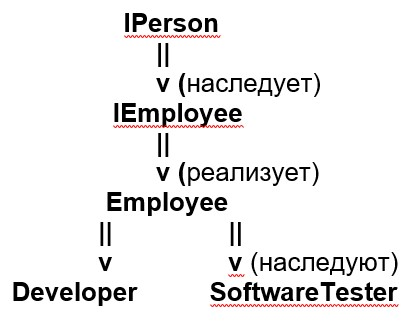

# Описание самостоятельного проекта по курсу "Программирование для .NET Framework".

##### Выполнил студент группы ИТ-22БО Майоров Александр.

## Общее описание:
Написанный мною проект является симуляцией работы некоторой компании, которую я назвал студией по разработке видеоигр. В штате студии есть два типа сотрудников: разработчики и тестировщики ПО, которые, так уж получилось, работают дискретно и параллельно. Это означает, что работа осуществляется подходами по 1 месяцу, и тестировщики могут сразу же тестировать то, что реализовали разработчики (в этот же месяц), но тестирование никогда не обгонят разработку (что вполне логично). Для нормальной работы студии необходимы хотя бы 1 разработчик и 1 тестировщик. Кроме сотрудников в моем проекте есть некоторые заказные разработки, над которыми собственно и трудятся сотрудники, получая таким образом з/п. Ну и наконец, основное внимание пользователя приложения должно быть направлено на бюджет студии, ведь именно из него вычитаются деньги на выплату з/п сотрудникам, пополняется он за счет выполненных разработок, и, самое главное, если он упадет до 0 и сотрудникам будет нечем платить, то работники разбегутся, а студия обанкротится. За счет найма/увольнения сотрудников, добавления/удаления заказных разработок, а также контроля за текущей разработкой пользователь должен поддерживать фирму “на финансовом плаву”.
## Реализованные механики:

1. Каждый нанимаемый сотрудник имеет некоторый опыт работы, полученный до работы в нашей студии, который постепенно увеличивается и в соответствии с которым высчитывается продуктивность работника и его з/п; также эти два параметра зависят от профессии – разработчик получает стартовую з/п (`50000` руб) и у него меньше производительность, а у тестировщика, наоборот, начальная з/п меньше (`30000` руб), а производительность выше, чем у разработчика с таким же опытом работы, и быстрее растет (скажем, что это все из-за автоматизации тестирования).

2. Опыт работы сотрудника повышается каждые 12 проработанных в студии месяцев, вместе с чем повышается его продуктивность и з/п – можно сказать, что каждый год работник повышает свою квалификацию.

3. Каждый сотрудник имеет один из двух уровней счастья – счастлив или нет. Изначально при найме все сотрудники счастливы. Но если им в каком-то месяце не заплатили, или выплатили меньше их з/п, то они становятся несчастными. Если несчастному сотруднику недоплатить второй раз, он не вытерпит и уволится.

4. Из бюджета ежемесячно вычитается некоторая сумма, равная сумме з/п всех сотрудников. Если она больше, чем осталось в бюджете, то делится на число всех работников, чтобы всем выплатить поровну. Те работники, для кого эта равная доля меньше их з/п, как говорилось выше, теряют счастье. При этом бюджет устанавливается в 0, нельзя нанимать новых работников и высвечивается соответствующее оповещение.

5. Заказные разработки различаются сложностью (с которой тесно связана продуктивность работников) и выплачиваемым за их выполнение вознаграждением. Исходя из этих параметров высчитывается изначальный приоритет разработки (вознаграждение / сложность разработки)

6. Каждый месяц сотрудники работают над какой-либо активной разработкой, при этом из сложности разработки вычитается суммарная продуктивность сотрудников определенной профессии (для разработчиков и тестировщиков сложность одинаковая и стадия разработки завершается при окончании работы тестировщиками, но, как уже говорилось, у тестировщиков продуктивность растет быстрее, так что их численность как правило меньше, ведь нет смысла обгонять темпы работы разработчиков). Если в начале месяца активной разработки нет, из очереди заказов берется разработка с наибольшим приоритетом (если эта очередь пуста, студия не может продолжать работать). Но активную разработку может выбрать и сам пользователь (ввиду несовершенства алгоритма определения наиболее приоритетной задачи).

7. Если активная разработка имеет слишком высокую сложность, а бюджет студии близится к нулю, то пользователь может отложить текущую разработку и взять вместо нее “попроще”, чтобы выправить бюджет. Отложенная при этом разработка помещается в очередь разработок с новым приоритетом: вознаграждение, деленное на оставшуюся работу для тестировщиков. Впоследствии отложенная разработка может быть продолжена с той стадии, на которой прекратились работы.

8. Текущие списки сотрудников и разработок логируются в файл `CurrentLists.txt` в папке `AppData`.

## Инструкция по работе с приложением:

1. В стартовом окне следует указать начальный бюджет студии и выбрать файлы со списками работников и разработок, для этого предложены файлы `workers.txt` и `developments.txt` (эти файлы можно не выбирать, но тогда придется в главном окне приложения вручную добавлять сотрудников и задачи). Аналогичные файлы с постфиксами –incorrect предназначены для демонстрации возможных ошибок вводимых данных при чтении из файла. После нажимаем `Создать студию` и видим главное окно приложения.

2. В главном окне находятся следующие элементы:

   2.1. В верхней части окна приводится полная статистика текущего состояния студии: анализ сотрудников каждой профессии слева, активная разработка справа (с кнопкой “Отложить” чтобы отложить активную разработку).

   2.2. По центру видим динамические списки сотрудников и очередь разработок, а между ними – основная кнопка для симуляции работы на протяжении месяца.

   2.3. Внизу окна – разнообразные кнопки для управления студией:  
   &nbsp; – `Добавить сотрудника` и `Добавить новую разработку` – назначение очевидно (учтите, что нельзя добавлять сотрудника при нулевом бюджете, также нельзя добавлять разработку с уже существующим названием). При нажатии открывается соответствующее окно для ввода информации.
   
**Сотрудники:**

- Имя начинается с большой буквы;
- Возраст от `20` до `80` лет;
- Опыт разработки соответствует возрасту (человек может начать получать опыт только с `18` лет).

**Разработки:**

- Уникальное название;
- Сложность разработки – от `1` до `1000`;
- Вознаграждение – не менее `100 000` руб.

– `Удалить выбранного сотрудника` – увольняем работника, выбранного в динамической таблице сотрудников.

– `Удалить разработку` – удаляем разработку, название которой введено в соответствующее текстовое поле (если задача с таким название существует в очереди разработок)

– `Начать выбранную разработку` – делаем выбранную в таблице разработку активной, если в данный момент сотрудники ни над чем не работают (либо поле текущей разработки пусто, либо текущая отображаемая разработка протестирована на 100%)

– `Начать заново` – позволяет вернуться к тому состоянию, в котором создалась студия, то есть к тем параметрам, которые были выбраны в стартовом окне.

В целом я постарался настроить систему оповещений пользователя, чтобы всячески помочь пользоваться приложением. Но не исключены упущенные ситуации, когда приложение может работать некорректно – прошу сообщить мне при столкновении с таковыми (над моим проектом не работали тестировщики, в отличие от тех разработок, которые я сымитировал). Теперь перейдем к программной части проекта.

## Описание выполненных требований:

1. Структура решения: в решении два проекта – одна сборка в виде файла dll и один исполнимый файл с графическим интерфейсом (WPF).

2. Иерархия, классы и интерфейсы: начнем с интерфейса `IPerson`, характеризующий качества сотрудника как человека (оставил только имя и возраст, хотя возраст нигде не меняется, так как не реализовывал выход на пенсию); от него наследует интерфейс `IEmployee`, характеризующий уже профессиональные качества и действия сотрудника. Интерфейс `IEmployee` реализует абстрактный класс `Employee`, от которого наследуют классы `Developer` и `SoftwareTester`, переопределяющие свойство `Speciality` и метод `ImproveSkills()`.

3. Класс `TodoList<Todo>` - пользовательская типизированная коллекция для хранения очереди разработок, реализует интерфейс `ICollection<Todo>`. Внутри определены методы `TakeMostPriorityItem()` для извлечения самой приоритетной задачи, и `Add()` (из интерфейса) для хранения разработок в отсортированном порядке (по убыванию приоритета); также определен индексатор для доступа к разработкам по их названиям. За основу взято хранилище `ObservableCollection<Todo> Items` – для отображения в контроле `ListView`.

4. Везде используются свойства используются вместо полей для хранения данных (даже в классах окон).

5. Механизм исключений используется практически в каждом классе и уж точно в каждом окне.

6. Работа с файлами – открытие со стандартным диалогом, запись в файл (логирование).

7. Переопределение операций – в классе `Todo` переопределены операции “>” и “<” (используются для сравнения при добавлении задачи в очередь).

8. Реализован полиморфизм: в классе `GameStudio` свойство `ObservableCollection<Employee> Workers` имеет в качестве параметра типа абстрактный класс, при работе с элементами этой коллекции (классами `Developer` и `SoftwareTester`) вызываются методы, характерными для первого или второго класса.

9. Реализован интерфейс `IDisposable` классом `GameStudio`, ресурсы освобождаются при закрытии окна (не уверен, что все сделал корректно, хотелось бы уточнить по этому поводу). При работе с неуправляемыми ресурсами при чтении из файла используются блоки using.

10. Реализован интерфейс `ICloneable` для создания глубокой копии объекта класса `GameStudio` (используется для хранения резервной копии стартовой студии в главном окне приложения).

11. В dll-сборке в файле `Enumerations.cs` используются перечисления для указания профессии и уровня счастья программиста.
